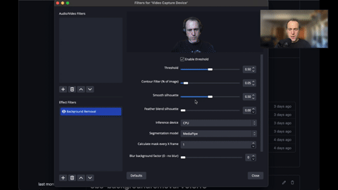

# OBS Plugin: Portrait Background Removal / Virtual Green-screen and Low-Light Enhancement

<div align="center">

[](https://github.com/royshil/obs-backgroundremoval/blob/main/LICENSE)
[](https://github.com/royshil/obs-backgroundremoval/actions/workflows/main.yml)
[](https://github.com/royshil/obs-backgroundremoval/releases)
[](https://github.com/royshil/obs-backgroundremoval/releases)

</div>

A plugin for [OBS Studio](https://obsproject.com/) that allows you to replace the background in portrait images and video, as well as enhance low-light scenes.

- [Introduction](#introduction)
- [Building](#building)
  - [MacOSX](#mac-osx)
  - [Linux (Ubuntu, Arch, openSUSE)](#linux)
  - [Windows](#windows)

## Download
Check out the [latest releases](https://github.com/royshil/obs-backgroundremoval/releases) for downloads and install instructions.

### Linux Installation
On Ubuntu, there are two ways to install OBS and you have to use the corresponding method to install this plugin.
- If you installed OBS via the official PPA, download the deb package from the [releases](https://github.com/royshil/obs-backgroundremoval/releases) page and install it directly.
- If you installed OBS via FlatHub, run the following command: `flatpak install com.obsproject.Studio.Plugin.BackgroundRemoval`

The pre-built binary of this plugin can run Ubuntu 22.04 or later.

On openSUSE, please see [`docs/BUILDING-OPENSUSE.md`](docs/BUILDING-OPENSUSE.md).

On other Linux distros, use the FlatHub installation of both OBS and this plugin.
If you install OBS in a way other than FlatHub, you have to build this plugin by yourself (see instructions for building [below](#linux)).

## Code Walkthrough
This video on YouTube will take you through the major parts of the code and explain them.

<div align="center">
  <a href="https://youtu.be/iFQtcJg0Wsk" target="_blank">
    
  </a>
</div>

## Requirements
- OBS version 28+ ([download](https://obsproject.com/download))

We do not support older versions of OBS since the plugin is using newer APIs.

## Introduction

This plugin is meant to make it easy to replace the background in portrait images and video.
It is using a neural network to predict the mask of the portrait and remove the background pixels.
It's easily composable with other OBS plugins to replace the background with e.g. an image or
a transparent color.

If you like this work, which is given to you completely free of charge, please consider supporting it by sponsoring us on GitHub:
- https://github.com/sponsors/royshil
- https://github.com/sponsors/umireon

OBS Plugins forum: https://obsproject.com/forum/resources/background-removal-portrait-segmentation.1260/

Tutorial video on YouTube: https://youtu.be/veqNEsMqEE0

[](https://youtu.be/veqNEsMqEE0)

GPU support:
* Currently on Windows we support DirectML, which should reduce CPU usage by 95% and effectively use the systems accelerators (GPUs if available).
* On Mac we support CoreML for acceleration, which is available on M1 and M2 (not Intel, sorry).
* CUDA is supported in this plugin through TensorRT, however it is supported only on Linux.
* The goal of this plugin is to be available for everyone on every system, even if they don't own a GPU.

Number of CPU threads is controllable through the UI settings. A 2-thread setting works best.

The pretrained model weights used for portrait foreground segmentation are taken from:
- https://github.com/anilsathyan7/Portrait-Segmentation/tree/master/SINet
- https://github.com/PaddlePaddle/PaddleSeg/tree/release/2.7/contrib/PP-HumanSeg
- https://github.com/PINTO0309/PINTO_model_zoo/tree/main/082_MediaPipe_Meet_Segmentation
- https://github.com/PeterL1n/RobustVideoMatting

Image enhancement (low light) models are taken from:
- https://github.com/PINTO0309/PINTO_model_zoo/tree/main/213_TBEFN
- https://github.com/PINTO0309/PINTO_model_zoo/tree/main/372_URetinex-Net
- https://github.com/PINTO0309/PINTO_model_zoo/tree/main/370_Semantic-Guided-Low-Light-Image-Enhancement
- https://github.com/PINTO0309/PINTO_model_zoo/tree/main/243_Zero-DCE-improved

Some more information about how I built it: https://www.morethantechnical.com/2021/04/15/obs-plugin-for-portrait-background-removal-with-onnx-sinet-model/

## Building

The plugin was built and tested on Mac OSX, Windows and Ubuntu Linux. Help is appreciated in building on other OSs and packages.

The building pipelines in CI take care of the heavy lifting. Use them in order to build the plugin locally. Note that due to the fact we're building and packaging OpenCV and ONNX Runtime the build times are quite long.

Start by cloning this repo to a directory of your choice.

### Mac OSX

Using the CI pipeline scripts, locally you would just call the zsh script.

```sh
$ ./.github/scripts/build-macos.zsh -c Release -t macos-x86_64
```

#### Install
The above script should succeed and the plugin files will reside in the `./release` folder off of the root. Copy the files to the OBS directory e.g. `/Applications/OBS.app/Contents/`.

To get `.pkg` installer file, run
```sh
$ ./.github/scripts/package-macos.zsh -c Release -t macos-x86_64
```
(Note that maybe the outputs in the e.g. `build_x86_64` will be in the `Release` folder and not the `install` folder like `pakage-macos.zsh` expects, so you will need to rename the folder from `build_x86_64/Release` to `build_x86_64/install`)

### Linux

#### Ubuntu

Use the CI scripts again
```sh
$ ./.github/scripts/build-linux.sh
```

#### Arch Linux
The community maintains AUR packages: https://aur.archlinux.org/packages/obs-backgroundremoval

#### FlatHub
The plugin is available on FlatHub: https://github.com/flathub/com.obsproject.Studio.Plugin.BackgroundRemoval

```sh
$ flatpak install com.obsproject.Studio.Plugin.BackgroundRemoval
```

### Windows

Use the CI scripts again, for example:

```powershell
> .github/scripts/Build-Windows.ps1 -Target x64 -CMakeGenerator "Visual Studio 17 2022"
```

The build should exist in the `./release` folder off the root. You can manually install the files in the OBS directory.

## Star History

[](https://star-history.com/#royshil/obs-backgroundremoval&Date)
