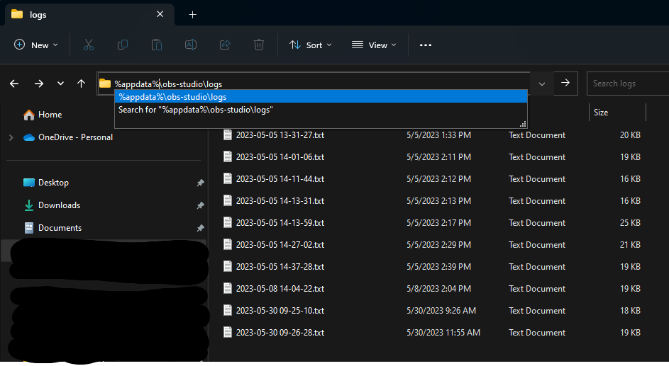

# Reporting Bugs

If you think you've found a bug, please report it by [opening an issue](https://github.com/royshil/obs-backgroundremoval/issues)

Please include the following information:
- Desription of the bug
- Steps to reproduce
- Expected behavior
- Actual behavior
- Screenshots
- OBS logs (Help -> Log Files -> Upload last log file, or by navigating to `%appdata%\obs-studio\logs`)
- OS (Windows, Mac, Linux) version and architecture (32/64 bit)
- OBS version
- (If relevant) GPU: model, driver version

## Grabbing logs from OBS from the disk
Here's a screenshot of the relevant location on disk for the logs: (Windows 10+)

Get the file that is the latest (by date) and upload it to the issue.
